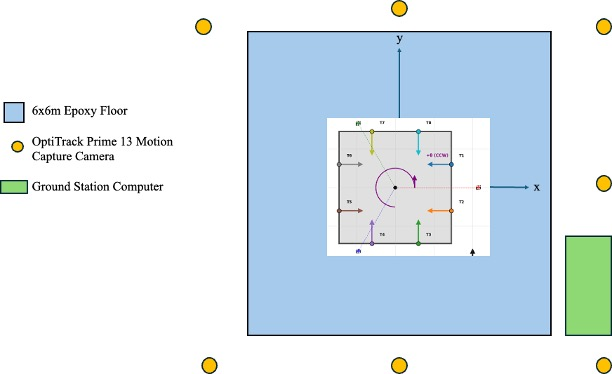

# Handoff Guide for Next Project Lead

**This document is for the person/team taking over the satellite project after the initial build.**

If you're reading this, this guide ensures you can operate it safely and maintain it properly.

---

## Table of Contents

- [First Week Checklist](#first-week-checklist)
- [System Health Verification](#system-health-verification)
- [Critical Information](#critical-information)
- [Maintenance Schedule](#maintenance-schedule)
- [Hardware Quirks & Workarounds](#hardware-quirks--workarounds)
- [Common Failures & Solutions](#common-failures--solutions)
- [Important Contacts](#important-contacts)
- [Documentation You'll Use Most](#documentation-youll-use-most)
- [Recording Your Own Knowledge](#recording-your-own-knowledge)

---

## First Week Checklist

### Setup and Verification

- [ ] **Get Gurobi License**
  - Go to: https://www.gurobi.com/academia/academic-program-and-licenses/
  - Register with your academic `.edu` email
  - Download `gurobi.lic` and place in project root
  - Verify: `python3 -c "import gurobipy; print('OK')"`

- [ ] **Install dependencies**
  ```bash
  pip install -r requirements.txt
  pip install pytest pytest-cov
  ```

- [ ] **Run simulation (no hardware needed)**
  ```bash
  python3 simulation.py
  # Select: 1. Waypoint Navigation
  # Enter waypoints: (0, 0), (1, 0), (1, 1)
  # Watch it execute—this proves the code works
  ```

- [ ] **Read critical docs**
  - [README.md](README.md) - Project overview
  - [ARCHITECTURE.md](ARCHITECTURE.md) - Architecture overview
  - [HARDWARE_TEST_PROCEDURE.md](HARDWARE_TEST_PROCEDURE.md) - Safety procedures
  - This handoff guide

### Hardware Verification

- [ ] **Physical Inspection**
  - [ ] Check for visible damage on satellite (thrusters, air bearings, markers)
  - [ ] Verify all 8 thrusters are securely mounted
  - [ ] Confirm 3 air bearings are securely attached to satellite underside
  - [ ] Check reflective markers are clean and securely attached

### Baseline Establishment

- [ ] **Quick Thruster Verification**
  ```bash
  cd Thruster_Test
  python3 thruster_test.py
  ```
  Fires each thruster 1-8 sequentially for 1 second.
  Quick sanity check that all thrusters respond and work before testing.

- [ ] **Thruster Recalibration** (STRONGLY RECOMMENDED)
  - [ ] Follow [THRUSTER_CALIBRATION.md](THRUSTER_CALIBRATION.md)

  This measures actual thruster forces and updates config.
  Takes ~1.5 hours.

- [ ] **Run Full Simulation Test**
  ```bash
  python3 simulation.py
  # Run through 2-3 complete missions
  # Verify performance is reasonable
  ```

- [ ] **Run First Hardware Mission**
  - [ ] Follow [HARDWARE_TEST_PROCEDURE.md](HARDWARE_TEST_PROCEDURE.md)

  ```bash
  python3 real.py
  # Start with simple waypoint (0,0) → (0.5, 0)
  # Verify it completes successfully
  ```

---

## System Health Verification

After completing the first week checklist, you should verify the overall system health:

### Software Health Check

```bash
# Run complete test suite
pytest -v

# Expected result: All tests should pass
# If tests fail: Review TROUBLESHOOTING.md
```

### Simulation Performance Baseline

```bash
# Run a standard waypoint mission
python3 simulation.py
# Select: Waypoint Navigation
# Use waypoints: (0,0) → (1,0) → (1,1) → (0,1) → (0,0)

# Check results:
# - Mission completes successfully
# - Final position error < 5cm
# - Final angular error < 3°
# - Plots generate without errors
# - Animation generates without errors
# - CSV data files are generated
```

### Hardware Health Check (If Available)

```bash
# 1. Thruster verification
python3 Thruster_Test/thruster_test.py
# All 8 thrusters should fire cleanly for 1 second each

# 2. Motion capture check
# - Open Motive
# - Place satellite on the floor
# - Verify all markers visible (should see satellite rigid body)
# - Check tracking quality (should be "Excellent" or "Good")

# 3. Simple hardware test
# Run a standard waypoint mission
python3 real.py
# Select: Waypoint Navigation
# Use waypoints: (0,0) → (0.5,0)

# Check results:
# - Mission completes successfully
# - Final position error < 5cm
# - Final angular error < 3°
# - Plots generate without errors
# - Animation generates without errors
# - CSV data files are generated
```

### Establish Performance Baselines

Record these values for future comparison:

- **Test Suite**: Number of tests passing (should be 300+)
- **Simulation MPC solve time**: Average (should be <15ms)
- **Hardware MPC solve time**: Average (should be <15ms)
- **Thruster calibration date**: When last calibrated
- **Tracking quality**: Motive reports "Excellent" with all markers visible

**Save this baseline** - you'll compare against it monthly to detect degradation.

---

## Critical Information

### What You MUST Know

#### 1. Thruster Layout and Coordinate System



#### 2. Safety

**Kill Switch**:
- Press `Ctrl+C` in terminal
- Close terminal
- Close air supply valves if needed
- Cut OFF power using the switches if needed

#### 3. Simulation vs Real Hardware

**Simulation** uses modeled physics (valve delay, drag, thrust ramp-up).
**Real hardware** will have subtle differences due to:
- Actual valve response time (may vary by thruster)
- Air bearing friction variations
- Environmental air currents
- Sensor noise characteristics

**Always test in simulation first, then on hardware.**

---

## Maintenance Schedule

### Before Every Session

- [ ] Inspect satellite and make sure all components are securely attached
- [ ] Check marker if any marker have fallen off
- [ ] Verify air supply pressure from main regulator (80 PSI ideal)
- [ ] Verify all solenoids work by running "python3 Thruster_Test/thruster_test.py"

### Weekly (if running experiments)

- [ ] Check Motive calibration
  - Open Motive, view 3D
  - If tracking is jittery → recalibrate
- [ ] Inspect air bearing underside for debris
- [ ] Check for unusual vibrations or sounds during operation

### Monthly

- [ ] **Thruster Recalibration** (Recommended!)
- [ ] Run full test suite: `pytest -v`
- [ ] Review log files for errors or warnings
  ```bash
  grep -i "error\|warning" Data/*/simulation.log
  ```
- [ ] Back up any experimental data
- [ ] Document any parameter changes you made

- [ ] **Motive System Recalibration** (Only if cameras have moved)
  - Follow OptiTrack Motive calibration procedure
  - Run wand calibration
  - Only needed if camera positions changed

- [ ] **Air Bearing Maintenance**
  - Clean air bearings, see recommended procedure by manufacturer (New Way Air Bearings)
  - Check for cracks or damage
  - Verify hover stability

---

## Hardware Quirks & Workarounds

### Known Hardware Characteristics

**Thrusters**:
- Individual thrusters may have slightly different response times
- Calibration recommended every 1-2 months depending on usage
- Solenoid valves have limited lifetime
- Check valve response during thruster test before each session

**Air Bearings**:
- Require clean, dust-free environment for optimal performance
- Each bearing may wear at different rates
- Periodic inspection prevents unexpected failures
- Dust or debris can cause catching on the floor

**Motion Capture System**:
- Marker occlusion can occur, ensure clear line of sight from cameras
- Tracking quality degrades if markers get dirty or damaged

**Environmental Factors**:
- Air currents from HVAC can affect trajectories
- Keep doors closed during tests

### Replacement Parts & Supplies

**Keep on hand**:
- Spare solenoid valves (check model in hardware documentation)
- Reflective markers (OptiTrack compatible)
- Extra USB cables for serial connections
- Compressed air cylinders
**Where to order**:
- Solenoid valves: [US Solid Solenoid](https://ussolid.com/products/u-s-solid-electric-solenoid-valve-1-4-12v-dc-solenoid-valve-plastic-nylon-body-normally-closed-nbr-seal-html?_pos=1&_fid=2e27ab75c&_ss=c)
- Relay: [Soldered Electronics Relay](https://www.digikey.com/en/products/detail/soldered-electronics/333024/21720418?gclsrc=aw.ds&&utm_adgroup=&utm_source=google&utm_medium=cpc&utm_campaign=PMax%20Shopping_Product_Low%20ROAS%20Categories&utm_term=&utm_content=&utm_id=go_cmp-20243063506_adg-_ad-__dev-c_ext-_prd-21720418_sig-Cj0KCQiA4-y8BhC3ARIsAHmjC_Gp3HIKXqy8acBu_1o8H_LtvwhB0vc2RvitcryPvQ2zQNhYerfNLLsaArZVEALw_wcB&gad_source=1&gbraid=0AAAAADrbLliKCa8GS7JVq-3PtBNczr4-x&gclid=Cj0KCQiA4-y8BhC3ARIsAHmjC_Gp3HIKXqy8acBu_1o8H_LtvwhB0vc2RvitcryPvQ2zQNhYerfNLLsaArZVEALw_wcB)
- Battery: Any M12 Milwaukee battery
- Air Bearings: [New Way Air Bearings - 40MM Flat Round](https://www.newwayairbearings.com/catalog/product/40mm-flat-round-air-bearings/)
- OptiTrack markers: https://optitrack.com/
- Generic hardware: McMaster-Carr, Amazon
- Air Cylinder: 40 Cubic Feet Compressed Air Zero Grade Cylinder from AWG

### Data Management

**Backup Strategy**:
- Experimental data stored in `Data/` directory
- Back up important results regularly (external drive or cloud)
- Keep CSV files - they're small and contain everything
- Archive mission_summary.txt files for quick reference

**Version Control**:
- If making code changes, use git branches
- Commit configuration changes with clear messages
- Document parameter changes in commit messages
- Consider forking the repo if making major modifications

---

## Common Failures & Solutions

### "Serial port not found"

**Symptom**: `real.py` fails to connect to microcontroller

**Diagnosis**:
```bash
ls /dev/tty*  # macOS/Linux
# Device Manager → Ports (COM & LPT)  # Windows
```

**Solution**:
- Verify USB cable is connected to microcontroller
- Check `/dev/ttyUSB0` (Linux) or `/dev/tty.usbserial-*` (macOS)
- Update `SERIAL_PORT` in config/constants.py if port number changed

### "Motive reports low tracking quality"

**Symptom**: Satellite position jittery or disappears

**Diagnosis**:
- Open Motive → View 3D
- Check if markers visible
- Count how many markers tracked (need ≥3)

**Solution**:
1. Clean markers with soft cloth
2. Verify cameras are focused
3. If cameras moved: recalibrate
   - Follow OptiTrack Motive manual
4. If markers are damaged: replace them

### "GurobiError: Model too large for license"

**Symptom**: Solver refuses to run

**Diagnosis**:
- Check you have academic license (not trial)
- Verify `gurobi.lic` is in project root

**Solution**:
- Get academic license (free): https://www.gurobi.com/academia/
- Place `gurobi.lic` in project root
- Restart Python
- Verify: `python3 -c "import gurobipy; print('OK')"`

### Satellite is catching on the floor while hovering

1. Make sure the epoxy floor is clean of dust/hairs/debris
2. Increase air pressure to 70 PSI
3. Air bearing might be clogged, try cleaning it


### Hardware test succeeds but satellite drifts off target

**Symptom**: Mission runs but final position is 20cm off

**Diagnosis**:
- Check if Motive is tracking correctly (compare to visual)
- Check thruster calibration date
- Check for air currents in lab
- Check solver time

**Solution**:
1. Verify Motive accuracy with visual inspection
2. Recalibrate thrusters
3. Close doors to reduce air currents
4. Check MPC parameters aren't too aggressive

### "Timing violation" errors

**Symptom**: Solver takes longer than 50ms (MPC_SOLVER_TIME_LIMIT)

**Diagnosis**:
```python
# Check last few lines of Data/Real_Test/.../real_test_data.csv
# Look for MPC_Computation_Time column
# If consistently > 0.050 (50ms), you have timing issues
```

**Solution** (in order of preference):
1. Close other CPU-intensive applications
2. Reduce `MPC_PREDICTION_HORIZON` in config/mpc_params.py
3. Reduce `MPC_CONTROL_HORIZON`
4. Increase `MPC_SOLVER_TIME_LIMIT`

---

## Important Contacts

### Technical Support (During Your Project)

**Contact Aevar through email**:
- Ask questions about design decisions
- Get help understanding the MPC formulation
- Discuss improvements/extensions
- Email: ofjord99@gmail.com

### For Ongoing Support

**Gurobi Issues**:
- https://support.gurobi.com/
- Free academic support (they're helpful!)

**OptiTrack Motive**:
- https://v21.optitrack.com/support/
- Reference their manual for calibration procedures

**Python/Dependencies**:
- Stack Overflow (for general Python issues)
- Package documentation (numpy, scipy, pyqt5)

### University Resources

**Faculty Advisors**:
- They understand the research goals
- They can approve budget for replacement parts

**Machine Shop**:
- If you need custom parts
- If you need common off the shelf hardware
- They have tools to be used inside the workshop

---

## Documentation You'll Use Most

1. **[HARDWARE_TEST_PROCEDURE.md](HARDWARE_TEST_PROCEDURE.md)**
   - Safety procedures
   - Hardware checks
   - Emergency procedures
   - **Reference this before every hardware run**

2. **[README.md](README.md)**
   - Quick reference for common commands
   - Installation troubleshooting
   - Links to specialized docs

3. **[TROUBLESHOOTING.md](TROUBLESHOOTING.md)**
   - Serial port issues
   - Solver problems
   - Hardware failures

4. **[config/physics.py](config/physics.py)**
   - Thruster positions and forces
   - Satellite mass and inertia
   - Update here when you recalibrate thrusters

5. **[ARCHITECTURE.md](ARCHITECTURE.md)**
   - When you need to understand why something works that way
   - Before modifying core algorithms

6. **[DEVELOPMENT_GUIDE.md](DEVELOPMENT_GUIDE.md)**
   - If you want to add features or fix bugs

---

## Recording Your Own Knowledge

**This is important**: You will learn things the original developer didn't document. Please record them, I made the mistake of not doing this.

### Create a Living Document

Create a file: `NOTES_FROM_[YOUR_NAME].md`

Document:
- Hardware issues you discover
- Parameters that work better than default
- Calibration results and dates
- Lessons learned
- Recommended improvements

**Example**:
```markdown
# Notes from Joe Smith (May 12th 2025)

## Hardware Discoveries
- Thruster 3 has slower response time (valve aging?)
  - Compensated in calibration
  - If fails: replacement solenoid $12, part #XYZ

- Air bearing left side needs daily cleaning
  - Dust accumulation causes vibration
  - Add to morning checklist

## Configuration Tweaks
- Changed MPC_PREDICTION_HORIZON from 15 to 12
  - Reason: Solver timing violations with new simulations
  - Result: Faster (40ms vs 50ms) with minimal loss in optimality

## Calibration Log
- Thruster recalibration: Dec 1, 2025
  - Forces changed ~5-10% from Aevar's original
  - Updated config/physics.py

## Recommended Next Steps
1. Replace solenoid on thruster 3 (backup valve available in cabinet)
2. Implement adaptive solver timeout (Gurobi supports this)
3. Add data logging for long-term performance tracking
```

### What to Document

When something surprises you:
- **"Oh, I need to do X before Y"** → Document it
- **"This parameter seems to work better"** → Document it
- **"This failed, here's the fix"** → Document it
- **"This part will need replacement eventually"** → Document it
