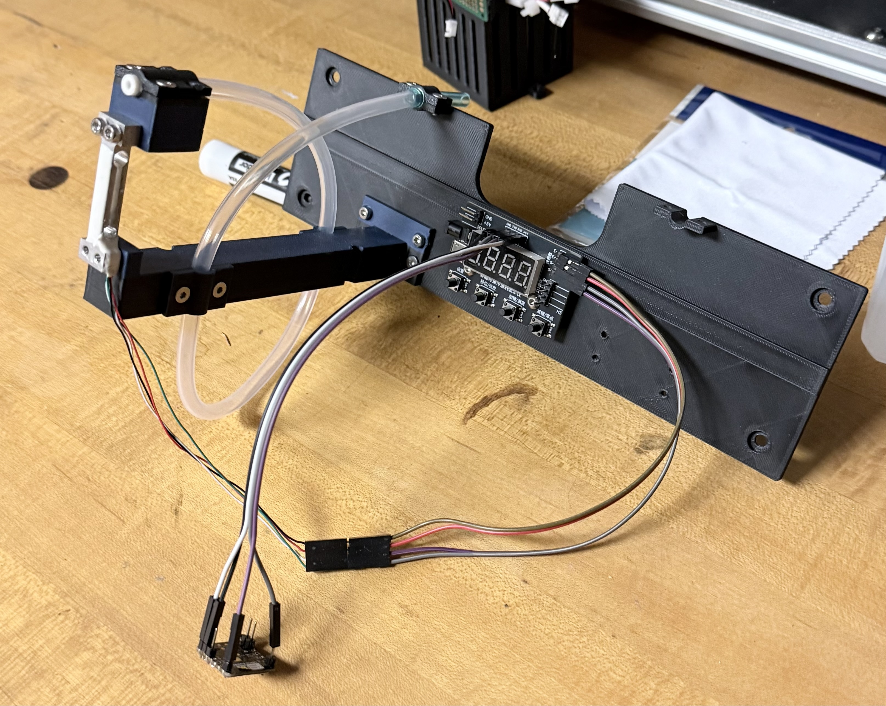
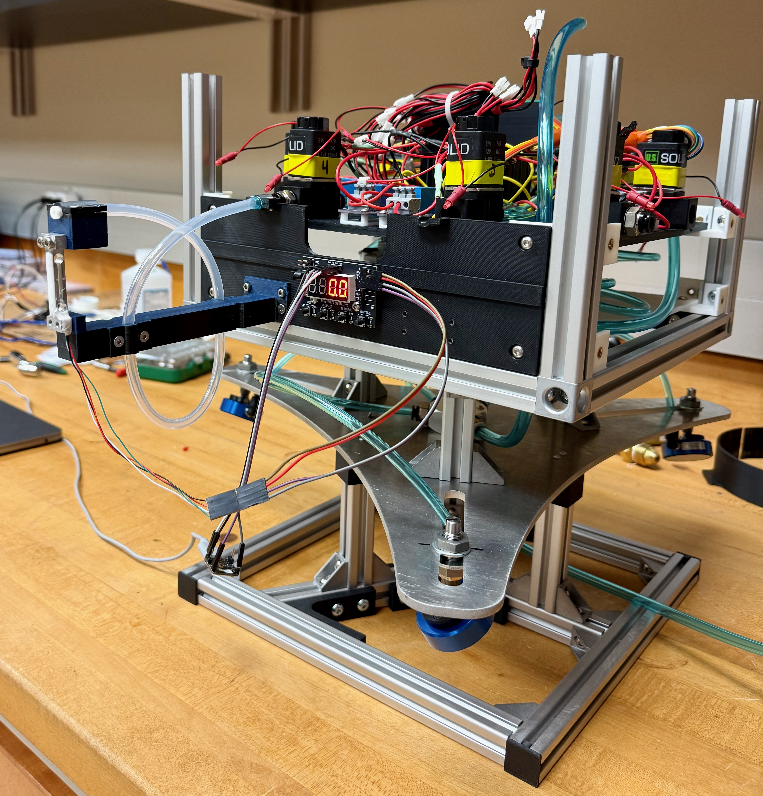
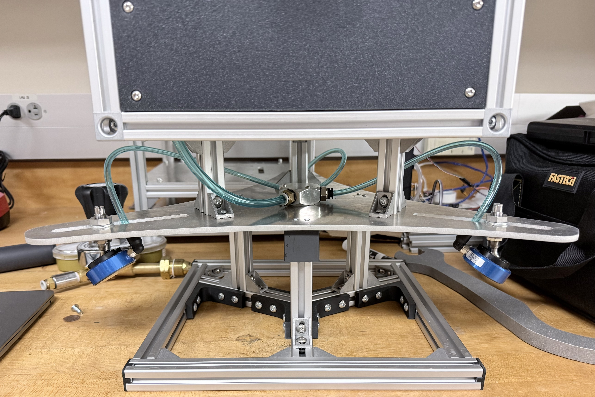

# Thruster Calibration Guide

Complete procedure for calibrating the 8 satellite thrusters and generating thrust values for the MPC controller.

**CRITICAL REQUIREMENTS**:
- **The satellite must be powered ON** with both 12V batteries installed and battery switches ON
- **ESP32 gateway must be connected to a computer** via USB for solenoid command communication
- **ESP32 for the load cell reading must be connected to a computer** to record data collected
- **Without these connections, thrust_calibration.py cannot send commands to open thrusters and no data is saved**

**IMPORTANT**: Thruster calibration must be performed before any mission operations to ensure accurate attitude control.

---

## Table of Contents

1. [Overview](#overview)
2. [Equipment Required](#equipment-required)
3. [Pre-Calibration Setup](#pre-calibration-setup)
4. [Running Calibration](#running-calibration)
5. [Analyzing Results](#analyzing-results)
6. [Updating Configuration](#updating-configuration)
7. [Troubleshooting](#troubleshooting)

---

## Overview

### What is Thruster Calibration?

Thruster calibration measures the **thrust output** of each of the 8 satellite thrusters. This data is essential for:

- **Accurate force control**: MPC controller must know exact thrust values
- **Attitude predictability**: Consistent thrust enables precise rotational control
- **Mission success**: Without calibration, control commands produce unpredictable results

### How It Works

The calibration system uses a **precision load cell** to measure force while each thruster fires sequentially. For each thruster:

1. **Baseline stabilization** (3 seconds) - Establishes zero reference
2. **Pulse sequence** (15 pulses) - Each pulse:
   - Pre-pulse phase (0.5s) - Baseline
   - Firing phase (10s) - Thruster active, force measured
   - Post-pulse phase (1.0s) - Force decay
   - Rest period (5s) - Cool down between pulses
3. **Data analysis** - Extract steady-state thrust from measurements
4. **Statistical summary** - Median thrust value recommended

### Key Operating Parameters

| Parameter | Value | Notes |
|-----------|-------|-------|
| Test duration per thruster | 10 seconds | Fixed firing duration per pulse |
| Pulses per thruster | 15 | Ensures statistical confidence |
| Pause between pulses | 5 seconds | Allows pressure stabilization |
| Air pressure (standard) | 40 PSI | Must match mission operating pressure |
| Load cell sampling rate | ~50 Hz | 20ms interval between readings |

---

## Equipment Required

### Hardware

- [ ] **Load cell system** (HX711-based with Xiao ESP32-S3 microcontroller)
  - Mounted on thrust bench
  - Calibrated and zeroed
- [ ] **ESP32 gateway** (for sending solenoid commands to thrusters)
  - Mounted on satellite
  - Powered by 12V batteries
- [ ] **USB cables** (2 total)
  - One USB cable for ESP32 gateway (solenoid commands)
  - One USB cable for Xiao ESP32-S3 (load cell data)
- [ ] **Satellite with 8 thrusters** mounted and connected
- [ ] **Two 12V batteries** (fully charged)
  - Required for thruster command communication
  - Battery adapters/mounts
- [ ] **Air supply** connected to the thruster regulator
- [ ] **Computer** with Python environment and available USB ports

### Software

- [ ] `Thruster_Test/thrust_calibration.py` - Main calibration script
- [ ] `Thruster_Test/thruster_test.py` - Optional quick verification to test that all solenoids work
- [ ] `Thruster_Test/analyze_thruster_data.py` - Analysis and reporting tool

---

## Pre-Calibration Setup

### 1. Satellite Preparation

Before mounting the thrust bench, prepare the satellite:

1. **Remove side panels**:
   - Screw off all side panels
   - Disconnect cameras from each panel
   - Disconnect distance sensors from each panel
   - Disconnect LED light from each panel
   - Set panels aside

2. **Remove thruster nozzles**:
   - Unscrew nozzles from all 8 thrusters
   - Keep nozzles in safe location (will reinstall after calibration)

3. **Prepare for tube connections**:
   - Each thruster being tested will connect via push-to-connect fitting

### 2. Thrust Bench Setup and Mounting

The thrust bench is used to measure thruster force output.




**CRITICAL - Satellite Must Be on Stand**: During calibration, the satellite **must be placed on a test stand** (not floating on the floor). The satellite should NOT be on air bearings during thrust calibration testing. This keeps the satellite stable and prevents unwanted motion during measurements.



1. **Prepare thrust bench**:
   - Ensure HX711 module is mounted securely to bench
   - Verify load cell is properly calibrated (see Load Cell Calibration below)
   - Check all mechanical connections are tight
   - Check all wires are connected
  
2. **Install push-to-connect fittings**:
   - Screw a 6mm OD push-to-connect fitting onto the thruster nozzle port
   - Use 6mm OD tubing to connect from fitting to thrust bench
   - Ensure tight connection (no air leaks)

3. **Mount thrust bench to satellite**:
   - Attach thrust bench to the satellite structure
   - Ensure stable, rigid mounting (no flex or movement)
   - Push the 6mm OD tubing into the push to connect fitting
   - Ensure tight connection (no air leaks)

### 3. Load Cell Calibration (CRITICAL - DO BEFORE EACH TEST)

**IMPORTANT**: The load cell must be calibrated before each test to ensure accurate measurements.

**Load cell specifications**:
- **Maximum rated capacity**: 100 grams
- **WARNING**: Exceeding 100g will break the load cell and give inaccurate readings
- **Calibration frequency**: Before each test

**Calibration procedure**:

1. **Disconnect the thrust bench** from any air supply
2. **Ensure load cell free hanging** no force applied to the load cell other then gravity
3. **Use a known small weight** (recommend 20g-50g calibration weight)

4. **Tare the load cell**:
   - Use the calibration button on the HX711 module
   - Place the thrust bench so that the load cell is hanging freely and only supported at the base where it is connected to the thrust bench
   - Press "tare" or "zero" to set baseline
   - Load cell should read 0g

5. **Calibration**:
   - Place 50g test weight on load cell
   - Using the button on the HX711 module input the know weight(50gr) and press OK
   - Verify reading shows approximately 50g
   - Remove weight and verify it returns to 0g
   - Put the load back on the load cell and verify it reads 50g
   - Load cell is now calibrated and ready

**If calibration is incorrect**:
- Do NOT use load cell for testing
- Load cell may be damaged or need recalibration

### 4. Hardware Connections

**CRITICAL**: The satellite must be powered and the ESP32 gateway must be connected so the system can send commands to open/close thruster solenoid valves.

1. **Power the satellite**:
   - Install both 12V batteries into battery adapters (see HARDWARE_TEST_PROCEDURE.md section 1)
   - Turn ON both battery power switches
   - Verify battery voltage is adequate
   - **Both batteries must be ON for thruster command communication**

2. **Connect ESP32 gateway to computer**:
   - Plug USB cable from ESP32 gateway into computer
   - Note the serial port (e.g., `/dev/tty.usbserial-XXXXX` on macOS)
   - Gateway must be connected for thrust_calibration.py to send solenoid commands

3. **Connect ESP32 microcontroller (load cell) to computer**:
   - Plug USB cable from ESP32 (on thrust bench) into computer
   - Note the serial port for the load cell microcontroller
   - This receives force measurements from HX711

4. **Verify air system**:
   - Verify air lines are connected from air supply to solenoid valves
   - Air bearing valve should be CLOSED (no air to bearings during calibration)
   - Thruster valve should be OPEN (air flowing to thrusters)
   - Check for any loose connections

### 5. Air System Verification

Before calibration, verify the air system is properly configured:

1. **Air bearing valve**: CLOSED
2. **Thruster valve**: OPEN (air flowing to thrusters)
3. **Air supply**: Connected to thruster regulator

**Standard calibration pressure**: 40 PSI (Check if desired thrust is feasible using simulation.py if changing from 40 psi)

### 6. Identify Serial Ports for Both Microcontrollers

You have TWO microcontrollers connected that require different serial ports:
1. **ESP32 gateway** - sends commands to thrusters
2. **Xiao ESP32-S3** - reads force from load cell

Identify both ports:

**On macOS/Linux:**
```bash
ls /dev/tty.*
```

You should see two ports like:
- `/dev/tty.usbserial-XXXXX` - ESP32 gateway
- `/dev/tty.usbserial-YYYYY` - Xiao ESP32-S3 (load cell)

**On Windows:**
- Open Device Manager → Ports (COM & LPT)
- Note the two COM ports (e.g., COM20 and COM21)

**Tip**: Disconnect one USB cable at a time to identify which port is which.

### 7. Update thrust_calibration.py with Serial Ports

Edit `Thruster_Test/thrust_calibration.py` and update the serial ports:

**Find and update the GATEWAY serial port** (sends thruster commands):
```python
GATEWAY_SERIAL_PORT = '/dev/tty.usbserial-12345'  # ESP32 gateway port
# or
GATEWAY_SERIAL_PORT = 'COM20'                      # Windows example
```

**Find and update the LOAD CELL serial port** (reads force measurements):
```python
LOADCELL_SERIAL_PORT = '/dev/tty.usbserial-67890'  # Xiao ESP32-S3 port
# or
LOADCELL_SERIAL_PORT = 'COM21'                      # Windows example
```

Save the file after updating both ports.

**Important**: Use the correct port for each microcontroller or the calibration will fail.

---

## Running Calibration

### Quick Verification (Optional First Step)

Before full calibration, verify all 8 thrusters respond to commands:

```bash
cd Thruster_Test
python3 thruster_test.py
```

**Expected behavior**:
- Each thruster fires for 1 second sequentially
- All 8 thrusters should respond without delays
- No error messages in terminal
- Solenoid valves should click audibly

If any thruster doesn't fire, **stop and troubleshoot** (see Troubleshooting section).

### Full Calibration Test

**Run the calibration script:**

```bash
cd Thruster_Test
python3 thrust_calibration.py
```

**Test procedure (for your thrust bench setup)**:

1. **Select single thruster mode**
2. **Run each thruster twice consecutively**
   - First test (Test 1)
   - Second test (Test 2)
3. **Move to next thruster** and repeat
4. **Complete all 8 thrusters** with 2 tests each

**Recommended workflow:**

```bash
# First complete pass through all 8 thrusters (Test 1 each)
# Thruster 1 - Test 1
# Thruster 2 - Test 1
# ... Thruster 8 - Test 1

# Then repeat for second pass through all 8 thrusters (Test 2 each)
# Thruster 1 - Test 2
# Thruster 2 - Test 2
# ... Thruster 8 - Test 2
```

### During Calibration

**What to monitor:**

1. **Load cell readings - CRITICAL**:
   - **DO NOT EXCEED 100 GRAMS** on the load cell
   - If reading approaches 100g, **STOP immediately** and reduce air pressure
   - Exceeding 100g will break the load cell and render it unusable
   - Load cell will give inaccurate readings if overloaded
   - Typical safe range: 20-80g per thruster
   - If a thruster produces >100g: reduce regulator pressure and recalibrate

2. **Terminal output** - Shows real-time progress:
   ```
   [INFO] Testing Thruster 1...
   [INFO] Pulse 1/15 - Firing thruster...
   [INFO] Force readings: min=50g, max=80g, mean=70g
   ```

3. **Load cell force values** - Forces should be:
   - Positive values (grams-force)
   - Stable and repeatable across all 15 pulses
   - Well below 100g limit (target: 50-80g range)
   - Consistent between Test 1 and Test 2 for each thruster

4. **Audible feedback** - You should hear:
   - Solenoid valve clicks (normal)
   - Compressed air discharge (expected)

5. **Air pressure** - Monitor that:
   - Pressure remains stable at your test pressure
   - No sudden drops (indicates leak or insufficient air pressure supply)

### Data Collection

During each test, CSV files are automatically generated and saved:

**CSV files are created in**: `Thruster_Test/Thruster_Data/`

**File naming format**:
```
MPC_Thruster(N)_YYYYMMDD_HHMMSS.csv
```

Example:
```
Thruster_Test/Thruster_Data/
├── MPC_Thruster(1)_20250116_143022.csv    # Thruster 1 - Test 1
├── MPC_Thruster(1)_20250116_143522.csv    # Thruster 1 - Test 2
├── MPC_Thruster(2)_20250116_145022.csv    # Thruster 2 - Test 1
├── MPC_Thruster(2)_20250116_145522.csv    # Thruster 2 - Test 2
├── ...
└── MPC_Thruster(8)_20250116_165522.csv    # Thruster 8 - Test 2
```

**Each CSV file contains**:
- **t_s**: Time in seconds
- **weight_g**: Load cell reading in grams-force
- **bitmask**: Which thruster(s) are active
- **pulse_number**: Which pulse (1-15)
- **phase**: Test phase (baseline, pre_pulse, firing, post_pulse, pause)

---

## Analyzing Results

After all 8 thrusters have been tested twice, you now have 16 CSV files in `Thruster_Test/Thruster_Data/`. The next step is to analyze these files to extract the mean thrust values for each thruster.

### Analysis Workflow Overview

```
1. Run thrust_calibration.py twice per thruster
   ↓
2. 16 CSV files generated (2 per thruster)
   ↓
3. Run analyze_thruster_data.py
   ↓
4. Extract mean thrust values per thruster
   ↓
5. Update SET_EFFECTS matrix in config
```

### Running the Analysis Script

After all calibration tests are complete, run the analysis tool:

```bash
cd Thruster_Test
python3 analyze_thruster_data.py
```

The script will prompt you to select analysis mode. For your thrust bench calibration, use:

```bash
cd Thruster_Test
python3 analyze_thruster_data.py multi
```

This will analyze both test runs for each thruster and generate **mean thrust values**.

### Analysis Output - Mean Thrust Values

**The analysis generates:**
- **Mean thrust per thruster** - Average of Test 1 and Test 2 
- Peak thrust values
- Consistency metrics (standard deviation)
- Coefficient of variation (repeatability %)
- Summary report with all 8 thrusters

**Example output:**
```
Thruster Analysis Results
=========================

Thruster 1:
  - Test 1 thrust: 2.156 N
  - Test 2 thrust: 2.152 N
  - Mean thrust: 2.154 N (use this value)
  - Std Dev: 0.002 N
  - Consistency: 99.9%

Thruster 2:
  - Test 1 thrust: 2.142 N
  - Test 2 thrust: 2.138 N
  - Mean thrust: 2.140 N (use this value)
  - Std Dev: 0.003 N
  - Consistency: 99.8%

... (continues for Thrusters 3-8)
```

### Single Test Analysis (Optional)

To analyze a single CSV file in detail:

```bash
cd Thruster_Test
python3 analyze_thruster_data.py single Thruster_Data/MPC_Thruster\(1\)_20250116_143022.csv
```

**Output includes:**
- Peak thrust
- Mean thrust
- Median thrust
- Standard deviation (consistency measure)
- Coefficient of variation (%)
- 75th and 90th percentile values
- Visualization plots (10 graphs)

### Cross-Thruster Comparison (Optional)

Compare all 8 thrusters to verify uniformity:

```bash
cd Thruster_Test
python3 analyze_thruster_data.py compare
```

**Output includes:**
- Thrust comparison across all 8 thrusters
- Fleet mean and standard deviation
- **Uniformity grade** (Excellent/Good/Fair/Poor)
- **Reliability grade** (based on test consistency)
- Best/worst performing thrusters
- Thrust range (min to max)

**Important**: Thrusters should be within **±10% of each other** for good attitude control.

### Complete Analysis Pipeline (Recommended)

Run all analysis types with one command:

```bash
cd Thruster_Test
python3 analyze_thruster_data.py all
```

This generates:
- Single test reports for each CSV file
- Multi-test summaries and mean thrust values
- Cross-thruster comparison
- Comprehensive MPC configuration recommendations

---

## Updating Configuration

### Step 1: Extract Mean Thrust Values from Analysis

After running `analyze_thruster_data.py multi`, extract the **mean thrust values** for each thruster from the output. These are the average values from Test 1 and Test 2 for each thruster.

**Example mean thrust values**:
```
Thruster 1: 0.154 N
Thruster 2: 0.140 N
Thruster 3: 0.149 N
Thruster 4: 0.146 N
Thruster 5: 0.143 N
Thruster 6: 0.157 N
Thruster 7: 0.152 N
Thruster 8: 0.148 N
```

### Step 2: Update MPC Configuration with Mean Thrust Values

Edit `config/physics.py` and update the `THRUSTER_FORCES` matrix with your mean thrust values:

```python
# Update with YOUR calibrated mean thrust values from analyze_thruster_data.py
THRUSTER_FORCES = {
    1: 0.441450,  # N - Measured thruster forces
    2: 0.430659,
    3: 0.427716,
    4: 0.438017,
    5: 0.468918,
    6: 0.446846,
    7: 0.466956,
    8: 0.484124,
}
```

> **File location**: `config/physics.py`

---

## Troubleshooting

### Load Cell Overload or Damage

**Symptoms**: Load cell readings suddenly become erratic, negative, or jump wildly. Or load cell exceeded 100g during testing.

**CRITICAL - Do NOT continue testing!**

1. **Stop all tests immediately**
2. **Disconnect air supply** to thrusters
3. **Inspect load cell**:
   - Verify wiring connections are good
   - Recalibrate and check values again, if still behaving erratic most likely the load cell is damaged

**If load cell was overloaded**:
- Load cell may be permanently damaged
- Readings will be inaccurate

**Prevention**:
- Always monitor load cell readings during testing
- Stop immediately if reading approaches 100g
- Reduce air pressure if thrusters produce excessive force
- Calibrate load cell before each test

### Serial Port Issues

**Error**: `Serial port not found` or `Could not connect to load cell`

**Solutions**:
1. Verify USB cables are properly connected
2. Check Device Manager / System Preferences for ports
3. Try unplugging and replugging USB cables
4. Restart Python script
5. Check that the correct baud rate is used (115,200)

### Thruster Won't Fire

**Symptoms**: No air discharge, no solenoid click, load cell shows no force

**Causes and fixes**:
1. **Battery power OFF**:
   - Verify 12V battery switch is ON
   - Check battery charge level
   - Ensure battery connections are secure

2. **Wiring loose**:
   - Verify all wires to solenoid valves are connected
   - Check for pinched or damaged wires
   - Verify bitmask in calibration matches thruster mapping
  
3. **Insufficient Battery Power**:
   - Measure the voltage from the battery
  
4. **Burned relay or solenoid**:
   - Try paring with a relay from another solenoid
   - Try pairing the solnoid with another relay


### Load Cell Not Reading Force

**Symptoms**: Load cell shows 0g even when thruster fires

**Causes and fixes**:
1. **Load cell not properly zeroed**:
   - Run zero calibration on load cell
   - Verify scale shows 0g when no load applied

2. **Serial connection to load cell**:
   - Verify load cell USB cable is connected
   - Check port identification
   - Try different USB port on computer

### Inconsistent Thrust Values

**Symptoms**: Median thrust varies wildly between tests, high coefficient of variation (>15%)

**Causes and fixes**:
1. **Air pressure fluctuating**:
   - Check main regulator is stable at 40 PSI
   - Look for slow leaks reducing pressure over test
   - Verify air supply is adequate

2. **Solenoid valve sticking**:
   - Clean or replace solenoid valve
   - Check for air system contamination
   - Run short burst tests to verify responsiveness

---

## Complete Calibration Workflow Summary

Here's the end-to-end process from testing to deployment:

```
┌─────────────────────────────────────────────────────────────┐
│ 1. PREPARE                                                  │
│   - Place satellite on test stand (NOT floating)            │
│   - Remove side panels and nozzles                          │
│   - Mount thrust bench to satellite                         │
│   - Calibrate load cell (100g limit!)                       │
│   - Connect ESP32 for load cell and identify serial port    │
│   - Connect ESP32 for gateway and identify serial port      │
│   - Power on 12V batteries                                  │
│   - Close air bearing valve, open thruster valve            │
└─────────────────────────────────────────────────────────────┘
                          ↓
┌─────────────────────────────────────────────────────────────┐
│ 2. TEST                                                     │
│   - Run thrust_calibration.py twice per thruster            │
│   - 16 CSV files generated (2 per thruster)                 │
│   - Monitor load cell (never exceed 100g!)                  │
│   - Files saved to: Thruster_Test/Thruster_Data/            │
└─────────────────────────────────────────────────────────────┘
                          ↓
┌─────────────────────────────────────────────────────────────┐
│ 3. ANALYZE                                                  │
│   - Run: python3 analyze_thruster_data.py multi             │
│   - Extract mean thrust values for each thruster            │
│   - Verify uniformity                                       │
│   - Review consistency metrics                              │
└─────────────────────────────────────────────────────────────┘
                          ↓
┌─────────────────────────────────────────────────────────────┐
│ 4. UPDATE CONFIG                                            │
│   - Edit config/physics.py                                  │
│   - Update THRUSTER_FORCES matrix with mean thrust values   │  
└─────────────────────────────────────────────────────────────┘
                          ↓
┌─────────────────────────────────────────────────────────────┐
│ 5. REASSEMBLE                                               │
│   - Disconnect 6mm tubing and fittings                      │
│   - Remove thrust bench from satellite                      │
│   - Reinstall all thruster nozzles                          │
│   - Reconnect side panels and all connections               │
└─────────────────────────────────────────────────────────────┘
                          ↓
┌─────────────────────────────────────────────────────────────┐
│ 6. VERIFY                                                   │
│   - Run test mission with new thrust values                 │
│   - Verify control quality                                  │
│   - Satellite is now calibrated and ready for operations    │
└─────────────────────────────────────────────────────────────┘
```

---

## When to Recalibrate

Recalibrate thrusters if:

- **Pressure changed**: Different regulator setting requires recalibration
- **Thruster replaced**: New solenoid valve or nozzle
- **Suspect degradation**: Inconsistent behavior or reduced thrust
- **After major test series**: Verify no damage or wear

---

## Reference

### File Locations

| Component | File | Purpose |
|-----------|------|---------|
| Calibration script | `Thruster_Test/thrust_calibration.py` | Run calibration |
| Quick test | `Thruster_Test/thruster_test.py` | Verify responsiveness |
| Analysis tool | `Thruster_Test/analyze_thruster_data.py` | Analyze results |
| Data files | `Thruster_Test/Thruster_Data/` | CSV calibration data |
| Configuration | `config/physics.py` | Update THRUSTER_FORCES |

### Quick Command Reference

```bash
# Quick thruster verification
python3 Thruster_Test/thruster_test.py

# Run full calibration for all 8 thrusters
cd Thruster_Test && python3 thrust_calibration.py

# Analyze single test
python3 analyze_thruster_data.py single <filename>

# Multi-test analysis per thruster
python3 analyze_thruster_data.py multi

# Cross-thruster comparison
python3 analyze_thruster_data.py compare

# Complete pipeline (all analysis types)
python3 analyze_thruster_data.py all
```
